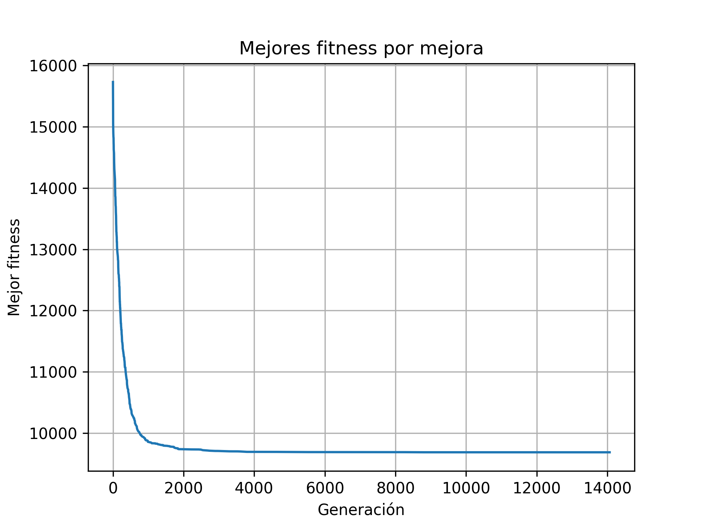

---
technologies:
  - Python
  - CuPy
  - NumPy
  - Pandas
  - Matplotlib
---

## Buscar coaliciones mínimas con un algoritmo genético

Este proyecto académico implementa un algoritmo genético para un problema de optimización combinatoria. La representación de las soluciones, la selección, el cruce y la mutación se evalúan mediante una función de fitness orientada a encontrar coaliciones mínimas.

También trabajé en la aceleración del cálculo con CuPy y comparé los resultados con una solución de referencia. Los benchmarks y las visualizaciones de convergencia ayudan a entender tanto la calidad de las soluciones como el costo de obtenerlas.
