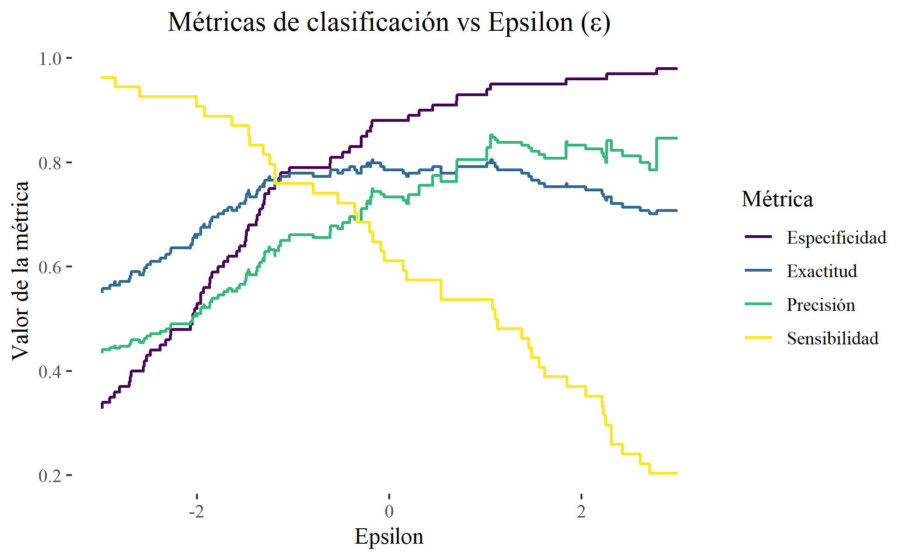

---
technologies:
  - R
  - Naive Bayes
  - Bootstrap
  - Monte Carlo
  - C/CUDA
---

## Un clasificador pequeño, pero con preguntas interesantes

Implementé un clasificador Naive Bayes gaussiano para predecir diabetes usando variables médicas del dataset PimaIndiansDiabetes. El proyecto fue desarrollado para un ramo y me interesó especialmente observar cómo el ajuste de epsilon cambia el comportamiento numérico y las métricas.

Además de la partición de entrenamiento y prueba, comparé sensibilidad, precisión, especificidad y exactitud. También dejé experimentos con bootstrap, Monte Carlo y una implementación acelerada mediante C/CUDA.

El resultado no es una herramienta clínica. Es un estudio reproducible sobre supuestos probabilísticos, evaluación de clasificadores y los compromisos que aparecen al implementar el algoritmo en lugar de tratarlo como una caja negra.
