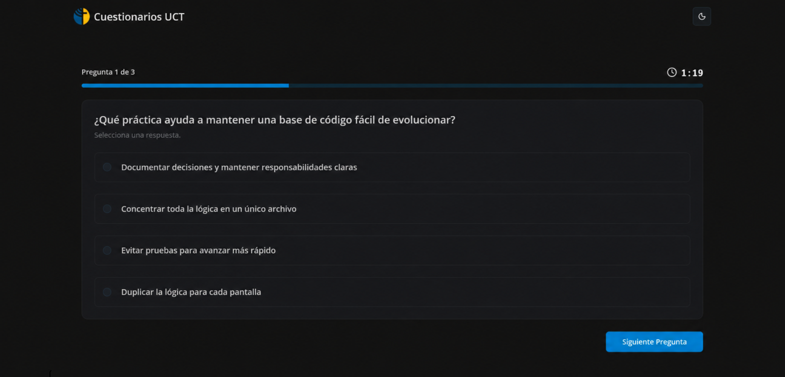

---
technologies:
  - Next.js
  - TypeScript
  - tRPC
  - Drizzle
  - PostgreSQL
  - FastAPI
---

## Un prototipo para crear cuestionarios personalizados

Cuestionarios UCT fue un encargo para la Universidad Católica de Temuco. La idea era que el docente definiera los parámetros globales de una evaluación y que luego cada estudiante pudiera generar su propio cuestionario a partir del trabajo realizado, con apoyo de IA.

Mi trabajo se concentró en el prototipo inicial de la aplicación web. Construí los flujos principales para docentes y estudiantes, junto con la integración entre la interfaz, el backend tipado y un servicio separado para procesar documentos mediante OCR.

## Qué alcanzó a resolver el prototipo

- Configurar los parámetros globales de una evaluación.
- Permitir que cada estudiante genere un cuestionario a partir de su trabajo.
- Procesar el material mediante un servicio separado de OCR.
- Responder cuestionarios y consultar sus resultados.
