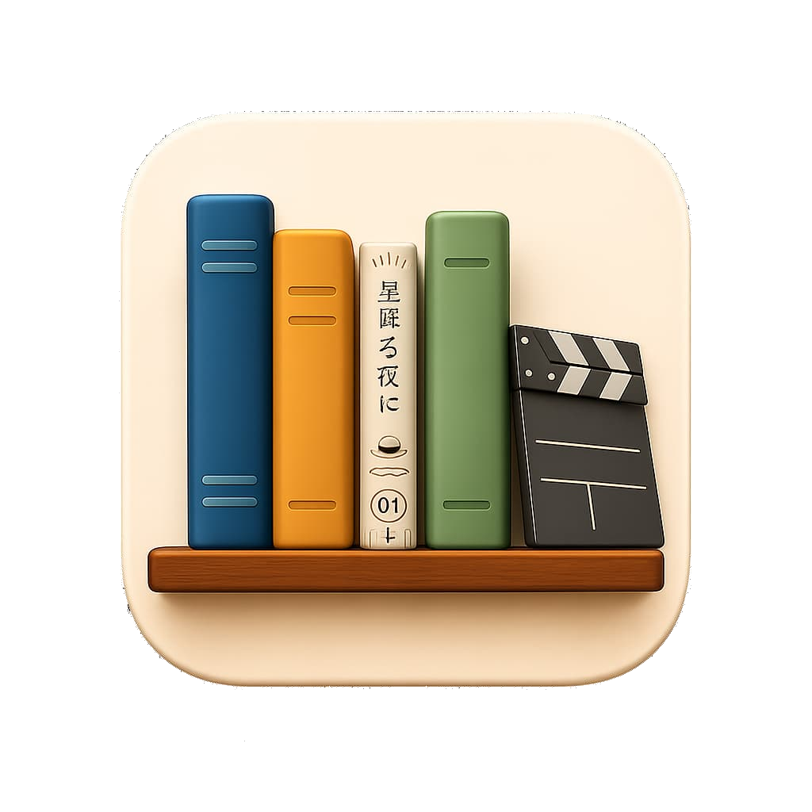

---
technologies:
  - React
  - TanStack Router
  - Convex
  - TypeScript
  - Vitest
  - Playwright
---

## Una biblioteca personal como sistema de información

Library es un sistema que estoy construyendo para centralizar libros, películas, series, anime y manga. La motivación no es crear otro catálogo público, sino tener un lugar propio para registrar qué consumo, tomar notas y mantener el progreso de lectura o reproducción.

El desafío principal está en diseñar un dominio que pueda representar distintos tipos de obras sin convertir cada nuevo tipo en una excepción. A partir de ese modelo, la aplicación incorpora datos privados por usuario, notas, progreso e integraciones con mis herramientas de lectura.

## En desarrollo

El sistema todavía está evolucionando. Estoy trabajando en el modelo de datos, la sincronización con KOReader, las notificaciones y los flujos de prueba que necesito para mantener estable una herramienta de uso cotidiano.
