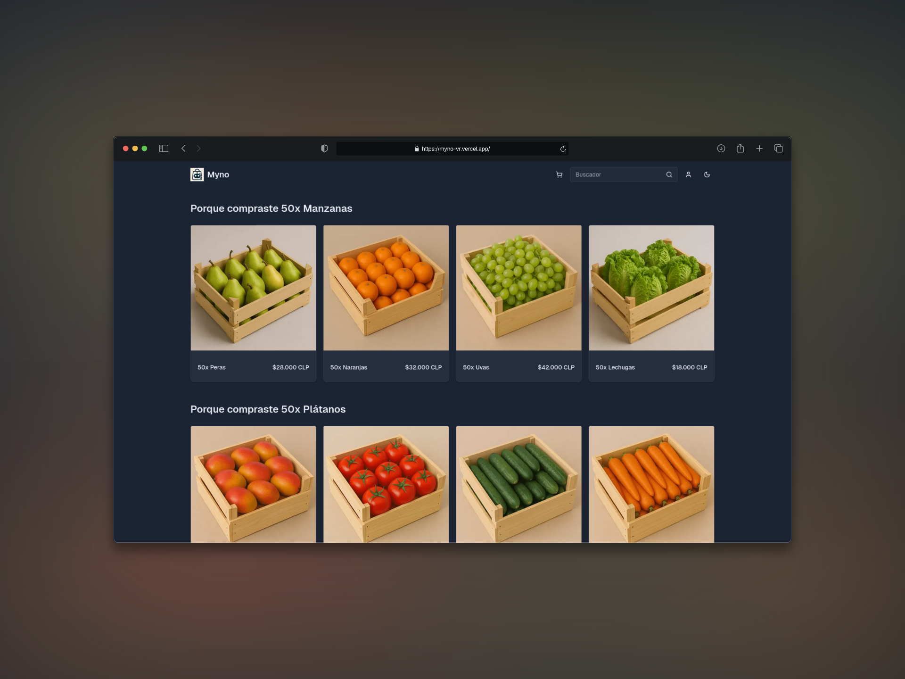

---
technologies:
  - Next.js 15
  - TypeScript
  - TanStack Query
  - Redis
  - Tailwind
  - shadcn/ui
---

## Un ecommerce B2B con recomendaciones

Myno fue un proyecto académico desarrollado para un ramo de la carrera. El objetivo era construir una experiencia de compra orientada a pequeñas empresas y explorar cómo recomendar productos usando el historial y el comportamiento de compra.

La aplicación incluye catálogo, búsqueda, filtros, carrito persistente, historial de compras y rutas protegidas. Las recomendaciones combinan tags, co-compra y popularidad global para cubrir distintos escenarios cuando todavía hay pocos datos de usuario.

## Alcance

Es una demo funcional con alcance acotado. No pretende ser un ecommerce listo para operar un negocio real; su valor está en integrar los flujos principales y comparar estrategias de recomendación dentro de un proyecto de curso.
