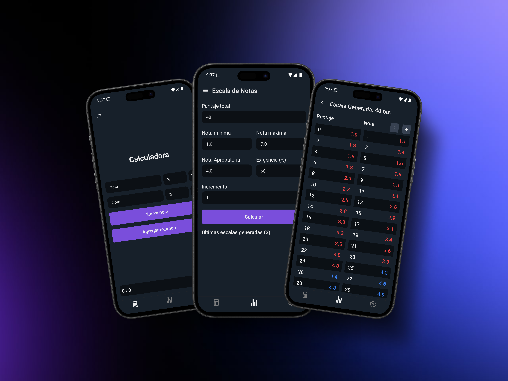

## De una calculadora de notas a una vista del semestre

PonderApp nació de una necesidad concreta: registrar y calcular mis notas cuando un ramo tiene evaluaciones compuestas. Una planilla puede resolver una parte del problema, pero se vuelve difícil de mantener cuando cambian las ponderaciones, aparecen subevaluaciones o quiero revisar el cálculo desde el teléfono.

La aplicación modela semestres, ramos, evaluaciones y subevaluaciones como una estructura editable. Así puedo ver cómo cada evaluación aporta al progreso del ramo, registrar nuevas notas sin rehacer fórmulas y simular escenarios para explorar qué resultado necesito en lo que falta.

También permite configurar y reutilizar escalas de notas. La escala deja de ser una tabla aislada y pasa a formar parte del cálculo de cada evaluación cuando las notas se registran a partir de puntajes.

## Diseñar alrededor de la disponibilidad

La decisión técnica y de producto más importante fue mantener el núcleo local-first: registrar, calcular y simular no debería depender de que exista una conexión o un backend disponible. Los datos académicos se persisten localmente y el respaldo o la sincronización son capacidades complementarias, no un requisito para usar la aplicación.

La misma lógica académica se comparte entre la aplicación móvil y la web. Ambas superficies son operativas: la aplicación móvil prioriza el uso local-first y la web permite trabajar con el mismo dominio académico desde el navegador. El respaldo y la sincronización conectan las experiencias cuando se necesitan.

## Qué construí

- El modelo de semestres, ramos, evaluaciones, subevaluaciones y escenarios de simulación.
- Los cálculos de progreso, aporte por evaluación y notas necesarias.
- La persistencia local y los flujos para trabajar sin conexión.
- La experiencia móvil, la aplicación web y la publicación en Google Play.

La desarrollé desde la definición del problema hasta la publicación. Antes de lanzarla, la probé con compañeros para detectar fricciones en el ingreso y la consulta de notas; desde entonces el proyecto ha seguido creciendo alrededor del mismo objetivo: hacer que el progreso académico sea más fácil de entender y revisar.
