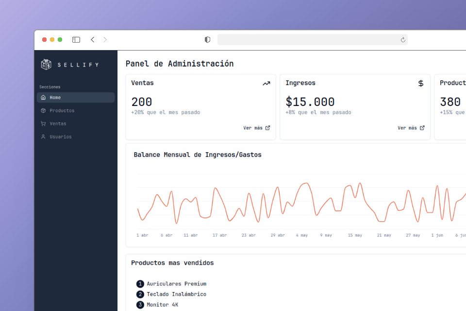

---
technologies:
  - React
  - TypeScript
  - TanStack Query
  - Tailwind
  - shadcn/ui
  - WebSockets
---

## Un sistema de ventas desarrollado en equipo

Sellify fue un proyecto grupal para un ramo de la carrera. Trabajamos en un sistema de ventas para pequeñas empresas, con un panel administrativo y una interfaz de punto de venta.

La entrega incluía dashboard, rutas privadas, fidelización y generación de boletas. El proyecto se desarrolló junto a otros equipos responsables de partes complementarias, por lo que su alcance corresponde a una entrega académica y no a un producto comercial terminado.
