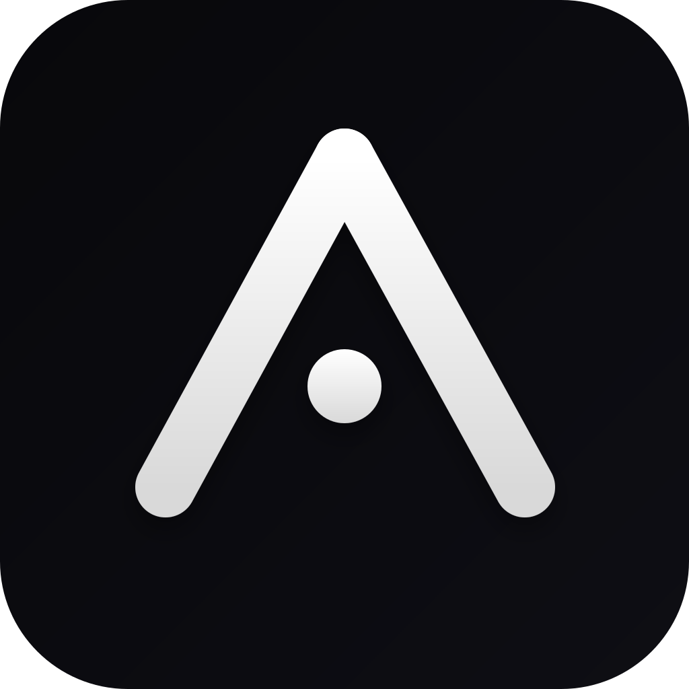

---
technologies:
  - React
  - TypeScript
  - Convex
  - TanStack
  - PWA
---

## Un clon parcial de Linear para mi propio flujo

Triangle partió como una maqueta de interfaz, pero terminó convirtiéndose en una herramienta personal para organizar proyectos e issues. Tomé algunas ideas de Linear y las adapté a la forma en que realmente quiero trabajar.

No busca ser un reemplazo general de Linear. El interés del proyecto está en construir una aplicación que pueda modificar sin depender de decisiones de producto ajenas: vistas guardadas, etiquetas, actividad, command palette y una navegación que se ajuste a mis hábitos.

## Qué estoy explorando

El proyecto me sirve para trabajar de manera práctica con persistencia en Convex, PWA, estados complejos de interfaz y decisiones de arquitectura en una aplicación que sigo usando y cambiando.
