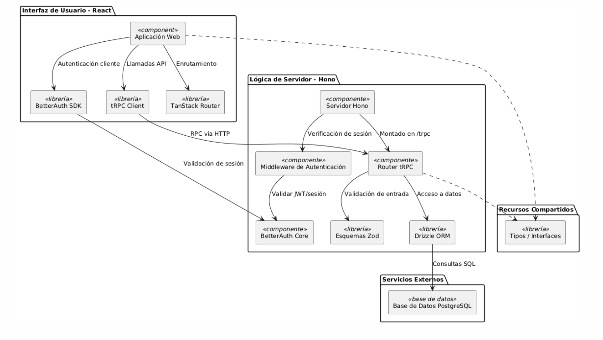

---
technologies:
  - React
  - Vite
  - TanStack Router
  - Hono
  - tRPC
  - PostgreSQL
  - Drizzle
---

## Gestión de flotas con roles y mantenimiento

Truckly fue desarrollado para un ramo de la carrera. La idea era concentrar en una sola plataforma la gestión de vehículos, usuarios, asignaciones y mantenimientos para una empresa con una flota pequeña o mediana.

El sistema distingue entre administradores y conductores. Cada rol accede a flujos diferentes para registrar vehículos, asignar recorridos o mantener actualizada la información de los vehículos.

El alcance fue el de una demostración funcional: usuarios de prueba, operaciones principales y una arquitectura full-stack suficiente para presentar los flujos relevantes del problema.
